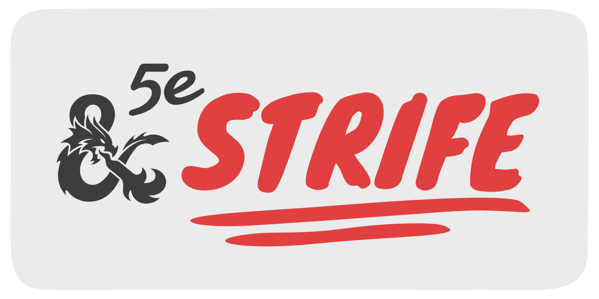

This is an online character sheet that I'm creating using React, Bootstrap and JSON. Currently not everything is implemented, although the site is up at <https://summerysaturn.github.io/5e-strife/>

This project is intended to be a full replacement for a form-filled or pen & paper character sheet, using JSON as the main method for saving/loading/storing/sharing characters.

## Goals

### General Project Goals

- [ ] JSON Model Complete
  - [x] Name
  - [x] Basic Info
  - [x] Abilities and Skills
  - [x] Background (bond, flaw, etc.)
  - [x] Combat Stats (AC, Speed, HP)
  - [ ] Attacks
  - [ ] Spells
  - [x] Inventory
    - [ ] Magic Items
  - [ ] Expand Movement & Vision
  - [ ] Attunement Slots
- [ ] Full site rendering to match a written character sheet
  - [X] Initial work on site rendering
  - [ ] Edit function for any displayed card
  - [ ] Feature parity with a real character sheet
- [ ] User-Expansion
  - [ ] JSON Implementation
  - [ ] React Implementation
- [ ] Import from JSON function
- [ ] Export to JSON function

### Page Element Goals

- [ ] Sidebar
- [x] Core Stats
- [ ] Saving Throws
- [ ] Skill Rolls
- [ ] Combat Stats
  - [x] HP
  - [ ] Speed
    - [ ] Walking
    - [ ] Flying
    - [ ] Swimming
    - [ ] Climbing
    - [ ] Burrow
  - [ ] Initiative
  - [ ] AC
  - [ ] Proficiency Bonus
  - [ ] Death Saves
  - [ ] Senses
- [ ] Character Info
  - [ ] Name
  - [ ] Class & Level
  - [ ] Alignment
  - [ ] Race
  - [ ] Sex
- [ ] Features & Traits
- [ ] Proficiencies & Languages
- [ ] Attack Panel
  - [ ] Physical Attacks
  - [ ] Spells
    - [ ] Cantrips
    - [ ] Level Spells
  - [ ] Misc Actions
- [ ] Inventory Panel
  - [ ] Inventory
  - [ ] Equipment

(for future reference)

- <https://www.dndbeyond.com/sources/basic-rules/monsters#Speed>
- <https://www.dndbeyond.com/sources/basic-rules/monsters#Senses>
- <https://www.dndbeyond.com/sources/basic-rules/adventuring#VisionandLight>

## JSON Properties

This implementation of a 5e character sheet in JSON is based on [this project form 2017](https://github.com/revuniversal/5e-sheets/), intended to be a full expansion allowing this site to act as a full replacement to a form-filled or pen & paper character sheet for standard 5e characters.

Additionally, it might be possible for this JSON to be normalised to allow user-expansion, such as adding in Lacing abilities from [Incarnate: The Last of the Lacers](https://www.dmsguild.com/product/191837/Incarnate-The-Last-of-the-Lacers), which has it's own not-quite-a-spell ability which might be useful to record.

- character:
  - name: string
  - alignment: string
  - background:
    - backgroundName: string
    - backstory: string
    - traits: string
    - ideals: string
    - bonds: string
    - flaws: string
  - stats:
    - class: string
    - experience: number
    - level: number
    - abilities: array:
      - name: string
      - abbreviation: string
      - score: number
      - modifier: number
    - skills: array:
      - name: string
      - advantage: boolean
      - proficiency: boolean
      - modifier: number
      - ability: string
    - savingThrows: array:
      - ability: string
      - advantage: boolean
      - proficiency: boolean
      - modifier: number
  - combatStats:
    - maxhp: number
    - hp: number
    - initiative: number
    - speed: number
    - ac: number
  - inventory:
    - coins: number
    - items:
      - name: string
      - count: number
      - value: number

## Usage

In the project directory, you can run:

### `npm install`

This will download all of the required dependencies for the usage of this project. Should be pretty self explanatory, but worth noting down here just in case.

### `npm start`

Runs the app in the development mode.

Open [http://localhost:3000](http://localhost:3000) to view it in the browser.

The page will reload if you make edits.

You will also see any lint errors in the console.

### `npm run build`

Builds the app for production to the `build` folder.

It correctly bundles React in production mode and optimizes the build for the best performance.

The build is minified and the filenames include the hashes.

Your app is ready to be deployed!

### `npm run deploy`

This command builds, just the same as `npm run build`, except also publishing it to github pages. The URL is written in `package.json`, and should be replaced if you aren't a contributor (me). The default URL is <https://summersaturn.github.io/5e-strife>.
